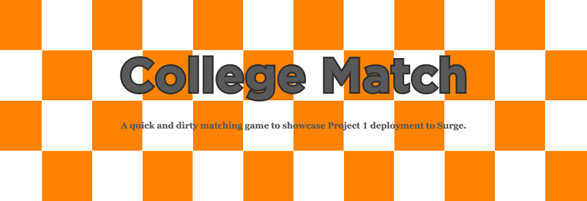
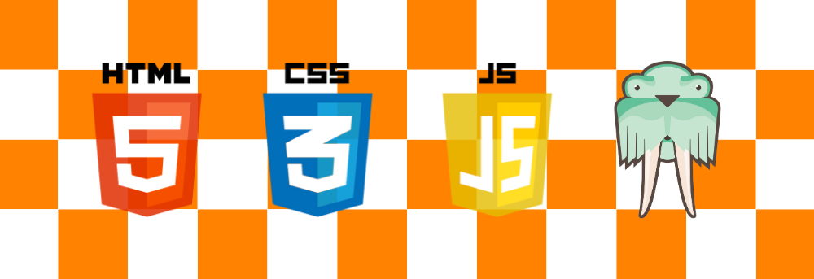
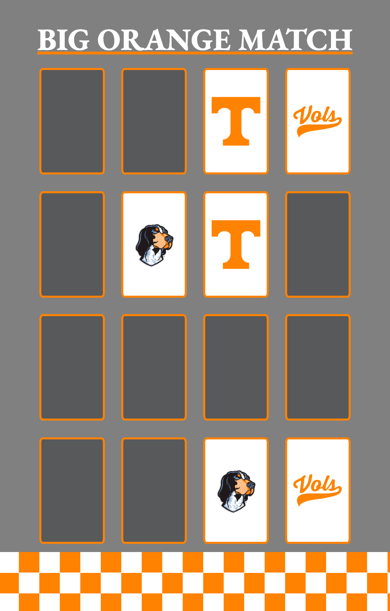
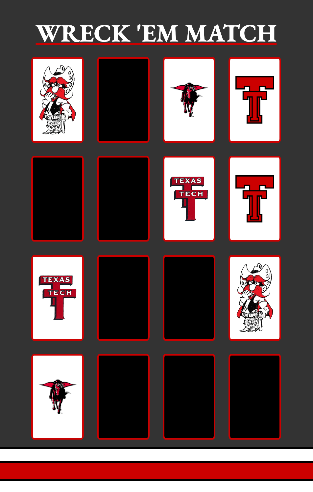

### Date: 11/29/2022

#### By: Michael Lackey

#### [Website](https://michaellackey.com/) | [GitHub](https://github.com/NobodysLackey) | [LinkedIn](https://www.linkedin.com/in/michaelglackey/)
***

### ***Description***

##### A quick and dirty matching game to showcase Project 1 deployment to Surge...

##### The project was deployed and can be viewed [here](https://collegematch.surge.sh/).

***

### ***Technologies Used***

***

### ***Getting Started***

##### Play through the game to try and match up the collegiate logos. Click the end-zone at the bottom for a surprise. Wreck 'em!

***

### ***Screenshots***

  <pre>
    &nbsp;&nbsp;&nbsp;
  </pre>

***

### ***Future Updates***

- [ ] User can choose their card deck at the beginning
- [ ] Win Message

***
